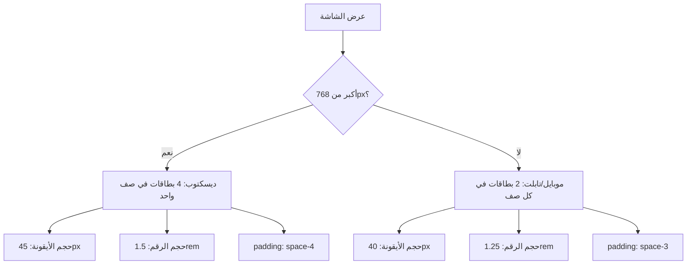

# خطة تصغير بطاقات الإحصائيات في لوحة التحكم

## الهدف
تعديل تصميم بطاقات الإحصائيات في لوحة التحكم لتكون:
- **على الديسكتوب**: 4 بطاقات في صف واحد
- **على الموبايل والتابلت**: 2×2 (بطاقتين في كل صف)

## الملف المستهدف
[`admin.html`](admin.html) - قسم الـ `<style>` الداخلي (السطور 21-790)

---

## التصميم الحالي

### بنية HTML للإحصائيات (السطور 882-920)
```html
<div class="stats-grid">
    <div class="stat-card">...</div>  <!-- المستخدمين -->
    <div class="stat-card">...</div>  <!-- المحلات -->
    <div class="stat-card">...</div>  <!-- الخدمات -->
    <div class="stat-card">...</div>  <!-- الأخبار -->
</div>
```

### CSS الحالي

#### `.stats-grid` (السطور 275-280)
```css
.stats-grid {
    display: grid;
    grid-template-columns: repeat(auto-fit, minmax(250px, 1fr));
    gap: var(--space-6);
    margin-bottom: var(--space-8);
}
```

#### `.stat-card` (السطور 282-294)
```css
.stat-card {
    background: var(--surface);
    padding: var(--space-6);
    border-radius: var(--radius-lg);
    box-shadow: var(--shadow);
    transition: var(--transition);
    border: 1px solid var(--border-color);
}
```

#### `.stat-icon` (السطور 296-305)
```css
.stat-icon {
    width: 60px;
    height: 60px;
    border-radius: var(--radius-lg);
    display: flex;
    align-items: center;
    justify-content: center;
    margin-bottom: var(--space-4);
    font-size: 1.5rem;
}
```

#### `.stat-value` (السطور 312-316)
```css
.stat-value {
    font-size: 2rem;
    font-weight: 700;
    color: var(--text-primary);
    margin-bottom: var(--space-2);
}
```

#### `.stat-label` (السطور 318-322)
```css
.stat-label {
    color: var(--text-secondary);
    font-size: 0.875rem;
    font-weight: 500;
}
```

#### الموبايل الحالي (السطور 783-785)
```css
@media (max-width: 768px) {
    .stats-grid {
        grid-template-columns: 1fr;
    }
}
```

---

## التغييرات المطلوبة

### 1. تعديل `.stats-grid`

**من:**
```css
.stats-grid {
    display: grid;
    grid-template-columns: repeat(auto-fit, minmax(250px, 1fr));
    gap: var(--space-6);
    margin-bottom: var(--space-8);
}
```

**إلى:**
```css
.stats-grid {
    display: grid;
    grid-template-columns: repeat(4, 1fr);
    gap: var(--space-4);
    margin-bottom: var(--space-6);
}
```

### 2. تصغير `.stat-card`

**من:**
```css
.stat-card {
    background: var(--surface);
    padding: var(--space-6);
    border-radius: var(--radius-lg);
    box-shadow: var(--shadow);
    transition: var(--transition);
    border: 1px solid var(--border-color);
}
```

**إلى:**
```css
.stat-card {
    background: var(--surface);
    padding: var(--space-4);
    border-radius: var(--radius);
    box-shadow: var(--shadow);
    transition: var(--transition);
    border: 1px solid var(--border-color);
    text-align: center;
}
```

### 3. تصغير `.stat-icon`

**من:**
```css
.stat-icon {
    width: 60px;
    height: 60px;
    border-radius: var(--radius-lg);
    display: flex;
    align-items: center;
    justify-content: center;
    margin-bottom: var(--space-4);
    font-size: 1.5rem;
}
```

**إلى:**
```css
.stat-icon {
    width: 45px;
    height: 45px;
    border-radius: var(--radius);
    display: inline-flex;
    align-items: center;
    justify-content: center;
    margin-bottom: var(--space-3);
    font-size: 1.2rem;
}
```

### 4. تصغير `.stat-value`

**من:**
```css
.stat-value {
    font-size: 2rem;
    font-weight: 700;
    color: var(--text-primary);
    margin-bottom: var(--space-2);
}
```

**إلى:**
```css
.stat-value {
    font-size: 1.5rem;
    font-weight: 700;
    color: var(--text-primary);
    margin-bottom: var(--space-1);
}
```

### 5. تعديل `.stat-label`

**من:**
```css
.stat-label {
    color: var(--text-secondary);
    font-size: 0.875rem;
    font-weight: 500;
}
```

**إلى:**
```css
.stat-label {
    color: var(--text-secondary);
    font-size: 0.75rem;
    font-weight: 500;
}
```

### 6. تحديث Media Queries للموبايل

**تعديل الـ media query الموجود (السطر 783-785):**

**من:**
```css
@media (max-width: 768px) {
    .stats-grid {
        grid-template-columns: 1fr;
    }
}
```

**إلى:**
```css
@media (max-width: 768px) {
    .stats-grid {
        grid-template-columns: repeat(2, 1fr);
        gap: var(--space-3);
    }
    
    .stat-card {
        padding: var(--space-3);
    }
    
    .stat-icon {
        width: 40px;
        height: 40px;
        font-size: 1rem;
        margin-bottom: var(--space-2);
    }
    
    .stat-value {
        font-size: 1.25rem;
    }
    
    .stat-label {
        font-size: 0.7rem;
    }
}
```

---

## مقارنة التصميم

```
قبل التعديل (الديسكتوب):
+----------------+  +----------------+  +----------------+
|   [أيقونة]     |  |   [أيقونة]     |  |   [أيقونة]     |
|    1,234       |  |     156        |  |      89        |
|  المستخدمين    |  |   المحلات      |  |   الخدمات      |
+----------------+  +----------------+  +----------------+
        +----------------+
        |   [أيقونة]     |
        |      45        |
        |   الأخبار      |
        +----------------+

بعد التعديل (الديسكتوب) - 4 في صف واحد:
+----------+  +----------+  +----------+  +----------+
| [أيقونة] |  | [أيقونة] |  | [أيقونة] |  | [أيقونة] |
|  1,234   |  |   156    |  |    89    |  |    45    |
|المستخدمين|  | المحلات  |  | الخدمات  |  | الأخبار  |
+----------+  +----------+  +----------+  +----------+

بعد التعديل (الموبايل) - 2×2:
+----------+  +----------+
| [أيقونة] |  | [أيقونة] |
|  1,234   |  |   156    |
|المستخدمين|  | المحلات  |
+----------+  +----------+
+----------+  +----------+
| [أيقونة] |  | [أيقونة] |
|    89    |  |    45    |
| الخدمات  |  | الأخبار  |
+----------+  +----------+
```

---

## ملخص التغييرات

| العنصر | قبل | بعد |
|--------|-----|-----|
| عدد الأعمدة (ديسكتوب) | auto-fit | 4 ثابتة |
| عدد الأعمدة (موبايل) | 1 | 2 |
| padding للبطاقة | space-6 | space-4 |
| حجم الأيقونة | 60×60px | 45×45px |
| حجم الرقم | 2rem | 1.5rem |
| حجم التسمية | 0.875rem | 0.75rem |
| الفجوة بين البطاقات | space-6 | space-4 |

---

## خطوات التنفيذ

- [ ] تعديل `.stats-grid` لاستخدام 4 أعمدة ثابتة
- [ ] تصغير padding في `.stat-card` وإضافة text-align: center
- [ ] تصغير حجم `.stat-icon` من 60px إلى 45px
- [ ] تقليل حجم الخط في `.stat-value` من 2rem إلى 1.5rem
- [ ] تقليل حجم الخط في `.stat-label` من 0.875rem إلى 0.75rem
- [ ] تحديث media query للموبايل ليظهر 2×2 بدلاً من عمود واحد

---

## ملاحظات إضافية

1. جميع التعديلات ستكون في قسم `<style>` داخل ملف [`admin.html`](admin.html)
2. لا حاجة لتعديل HTML - فقط CSS
3. التصميم سيكون متجاوب مع جميع أحجام الشاشات
4. يمكن إضافة breakpoint إضافي للتابلت إذا لزم الأمر

---

## Mermaid Diagram - تدفق التصميم المتجاوب


